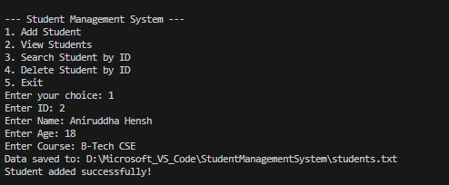

# 🎓 Student Management System (Java)

A simple **Student Management System** built in Java that allows you to **add, view, search, and delete student records**.  
This project is great for beginners to understand **OOP concepts** and **basic CRUD operations**.

---

## ✨ Features
- ➕ Add a new student  
- 📋 View all students  
- 🔍 Search student by ID  
- ❌ Delete student  

---

## 🛠️ Technologies Used
- Java (Core Java, OOP)
- IDE: VS Code

---

## 🚀 How to Run
1. Clone this repository:
   ```bash
   git clone https://github.com/anirudha-hensh/student-management-system-java.git


---

## 🖼️ Sample Output

Here’s how the program looks when running in the terminal:




📌 Future Improvements

(i)   Add file/database storage
(ii)  GUI using Swing/JavaFX
(iii) Update student records


🤝 Contributing

Pull requests are welcome. For major changes, please open an issue first to discuss what you would like to change.


📜 License

MIT License

Copyright (c) 2025 Anirudha Hensh

Permission is hereby granted, free of charge, to any person obtaining a copy
of this software and associated documentation files (the "Software"), to deal
in the Software without restriction, including without limitation the rights
to use, copy, modify, merge, publish, distribute, sublicense, and/or sell
copies of the Software, and to permit persons to whom the Software is
furnished to do so, subject to the following conditions:

The above copyright notice and this permission notice shall be included in all
copies or substantial portions of the Software.

THE SOFTWARE IS PROVIDED "AS IS", WITHOUT WARRANTY OF ANY KIND, EXPRESS OR
IMPLIED, INCLUDING BUT NOT LIMITED TO THE WARRANTIES OF MERCHANTABILITY,
FITNESS FOR A PARTICULAR PURPOSE AND NONINFRINGEMENT. IN NO EVENT SHALL THE
AUTHORS OR COPYRIGHT HOLDERS BE LIABLE FOR ANY CLAIM, DAMAGES OR OTHER
LIABILITY, WHETHER IN AN ACTION OF CONTRACT, TORT OR OTHERWISE, ARISING FROM,
OUT OF OR IN CONNECTION WITH THE SOFTWARE OR THE USE OR OTHER DEALINGS IN THE
SOFTWARE.


